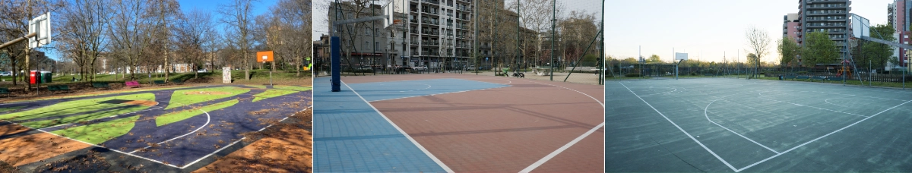
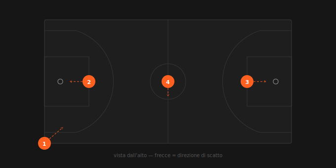

🇬🇧 English | [🇮🇹 Italiano](README.it.md)



# 🏀 Basketball courts in Milan

A photographic atlas of free-access basketball courts in Milan and surrounding areas.

**[Browse the atlas →](https://photogabe.github.io/alcampetto/index.en.html)**

For each court, the following data points are available:

- geographic details: address and GPS coordinates;
- court features: number of hoops, three-point line, fencing, lighting, indoor/outdoor;
- qualitative notes on the condition of hoops and court surface;
- photo gallery: from two to five images per court;
- freshness indicator (green if data is less than 12 months old, yellow between 12 and 24 months, grey if older).

## Contribute

Found a court that's missing? Report it through the **[contribution form](https://tally.so/r/QKYOlX)**.

Before opening a pull request, please [open an issue](https://github.com/photogabe/alcampetto/issues/new) first to discuss your idea and get feedback from the maintainer.

## Note on images

The images in this repository are web-optimized (resized and converted to webp format) to ensure smooth browsing. They are not intended as high-resolution prints.

## Photography protocol

All images are captured following a standardised protocol to ensure consistency and comparability across courts.

### General conditions

- **Time of day:** morning, preferably early (soft light, empty courts). Photos taken later in the morning are also accepted, provided lighting conditions are adequate.
- **Court:** empty, no people in frame.
- **Light:** natural. Overcast or clear sky both acceptable. Avoid harsh midday direct light.
- **Equipment:** DSLR or mirrorless camera (RAW files preferred). Smartphones are accepted as a secondary option; photos may be replaced in the future with higher-resolution shots.

### The 4 standard shots



| # | Name | Position | Subject |
|---|---|---|---|
| 1 | Overview | Least obstructed corner, eye level | Full court in frame, landscape orientation |
| 2 | Hoop 1 | Free-throw line, central axis of the paint | Hoop, backboard and part of the paint |
| 3 | Hoop 2 | Free-throw line, opposite end | Same as photo 2, mirrored |
| 4 | Surface | Centre court, standing upright | Camera pointing straight down (nadir); centre circle and half-court line in frame |

### Documented exceptions

- The 4 standard shots may be supplemented — never replaced — by additional photos documenting particular conditions of the court.

## Dataset version

Current version is **0.4.0**.
At this stage of the project (0.x), compatibility with previous versions of the JSON structure is not guaranteed.

## Data schema

Each court is described by a JSON object. Fields are grouped by category.

### Identification

| Field | Type | Description |
|---|---|---|
| `id` | `string` | Unique court identifier (e.g. `"001"`). |
| `created` | `string` | Date the record was first created, `YYYY-MM-DD`. |
| `updated` | `string` | Date of the last update, `YYYY-MM-DD`. |

### Location

| Field | Type | Description |
|---|---|---|
| `address` | `string` | Street or square nearest to the court. |
| `city` | `string` | Municipality name (e.g. `"Milano"`, `"Sesto San Giovanni"`). |
| `district` | `string\|null` | Administrative subdivision (e.g. `"Municipio 8"`). `null` for municipalities without subdivisions. |
| `coordinates` | `object` | Geographic position with `lat` and `lng` (WGS 84). |

### Court features

| Field | Type | Description |
|---|---|---|
| `hoops` | `integer` | Number of hoops (typically 1, 2 or 4). |
| `surface` | `string` | Materials used for the surface. |
| `half_court` | `boolean` | `true` if the court is a half court only. |
| `three_pt_line` | `boolean` | `true` If a three-point line is marked on the surface. |
| `fenced` | `boolean` | `true` If the court is enclosed by a fence. |
| `free` | `boolean` | `true` If access is free of charge. |
| `lit` | `boolean` | `true` If the court has lighting for evening play. |
| `indoor` | `boolean` | `true` If the court is indoors or has a roof cover. |

### Media and text

| Field | Type | Description |
|---|---|---|
| `photos` | `array` | Array of photo surveys, ordered from most recent to oldest. Each element is an object with the fields described below. `photos[0]` is always the current survey. |
| `photos[].date` | `string` | Date of the survey, `YYYY-MM-DD`. |
| `photos[].overview` | `string\|null` | Wide-angle photo. Path relative to the project root. |
| `photos[].context` | `string\|null` | Context photo (optional). |
| `photos[].details` | `array` | Array of close-up photos. See photography protocol section. |
| `photos[].autore` | `array` | Array of artistic photos (optional). |
| `i18n` | `object` | Localised text, keyed by ISO 639-1 language code (`it`, `en`, …). Each language provides `nome` (court name) and `note` (free-text description). |

### Example

```json
{
  "id": "001",
  "created": "2026-02-20",
  "updated": "2026-02-20",
  "address": "Via Benedetto Croce",
  "city": "Milano",
  "district": "Municipio 8",
  "coordinates": { "lat": 45.49409, "lng": 9.11730 },
  "hoops": 2,
  "surface": "cemento",
  "half_court": false,
  "three_pt_line": true,
  "fenced": false,
  "free": true,
  "lit": false,
  "indoor": false,
  "photos": [
    {
      "date": "2026-02-20",
      "overview": "photos/001/overview.webp",
      "context": null,
      "details": [
        "photos/001/dettaglio-1.webp",
        "photos/001/dettaglio-2.webp",
        "photos/001/dettaglio-3.webp"
      ],
      "autore": []
    }
  ],
  "i18n": {
    "it": {
      "nome": "Campetto di Giardino Vieira De Mello",
      "note": "Ben tenuto. Superficie in ottime condizioni."
    },
    "en": {
      "nome": "Giardino Vieira De Mello Basketball Court",
      "note": "Well maintained. Surface in good condition."
    }
  }
}
```

---

_Code is generated with the assistance of Claude AI_
